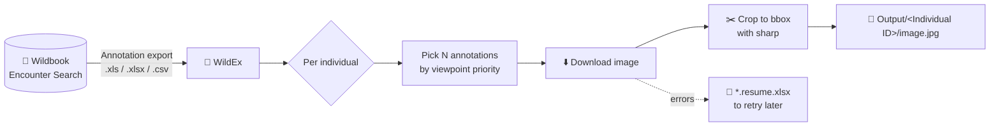

<div align="center">


# WildEx · Wildbook Export

### Download cropped, per-individual annotation images from any Wildbook

**Desktop app that turns a Wildbook *Encounter Annotation Export* into a folder of cropped images, one sub-folder per individual, ready for catalogues, training data or field guides**

[](https://github.com/antonalvarezbc/WildbookExport/releases/latest)
[](https://github.com/antonalvarezbc/WildbookExport/actions/workflows/build.yml)
[](#-download--install)
[](https://www.electronjs.org/)
[](https://react.dev/)
[](https://www.typescriptlang.org/)
[](LICENSE)

### ⬇️ [Download the latest release](https://github.com/antonalvarezbc/WildbookExport/releases/latest)

</div>

---

## 📖 Table of contents

- [Why WildEx](#-why-wildex)
- [How it works](#%EF%B8%8F-how-it-works)
- [Usage](#-usage)
- [Viewpoint selection](#-viewpoint-selection)
- [Resuming failed downloads](#-resuming-failed-downloads)
- [Download & install](#-download--install)
- [Development](#%EF%B8%8F-development)
- [What this fork adds](#-what-this-fork-adds)
- [Credits & license](#-credits--license)

---

## 🌍 Why WildEx

[Wildbook](https://www.wildme.org/) platforms store thousands of annotated wildlife photos, but exporting them is not straightforward: the *Encounter Annotation Export* is a spreadsheet of image URLs and bounding boxes, not the images themselves.

**WildEx reads that spreadsheet, downloads every image, crops it to the annotation's bounding box and saves it in a folder named after the individual.** You choose how many annotations to keep per individual, and it picks the most useful viewpoints for you.

Typical uses: building photo catalogues of known individuals, preparing datasets to train re-identification models, or sharing curated images with field teams.

## ⚙️ How it works



**Output layout:**

```text
<download folder>/
└── <export file name>/
    ├── Individual_A/
    │   ├── img_001.jpg      ← cropped to the annotation bbox
    │   └── img_014.jpg
    ├── Individual_B/
    │   └── ...
    └── Unidentified_annotations/   ← only if you include unidentified encounters
```

## 🧭 Usage

1. In Wildbook, run an **Encounter Search** and save the **Encounter Annotations Export** file. Filter the search (location, date, species…) to keep the download manageable.
2. Open WildEx and **select the export file**: `.xls`, `.xlsx` or `.csv`.
3. Choose whether to **include unidentified encounters** (default: no).
4. Choose the **number of annotations per individual**: 1 to 10, or *All*.
5. Pick the **download folder** and wait for the download to finish.

> [!WARNING]
> Choosing **All** downloads every annotation of every encounter in the export. That can take a long time and use a lot of bandwidth and disk space. Prefer a smaller, filtered export.

Annotations with an empty or `null` bounding box are skipped automatically.

## 👁️ Viewpoint selection

When you ask for fewer annotations than an individual has, WildEx chooses them by viewpoint so each individual is represented from its most informative sides:

| Annotations per ID | Viewpoints chosen (in order) |
|---|---|
| **1** | left, otherwise right |
| **2** | left + right |
| **3–5** | the first N of: left, right, front, back, up |
| **6+** | the five above, then any remaining viewpoints |
| **All** | every annotation |

If an exact viewpoint is missing, a **similar** one is used instead (e.g. `frontleft` or `backleft` for `left`), and if that is missing too, any available viewpoint fills the slot.

## 🔁 Resuming failed downloads

If some images fail (network errors, missing URLs, cancellation), WildEx writes a **`*.resume.xlsx`** file listing the failed annotations with an error message, plus the original settings in a second sheet.

Open that file in WildEx and press download again: it **retries only the failed images** with the same folder and options.

## ⬇️ Download & install

Get the installer for your system from the **[latest release](https://github.com/antonalvarezbc/WildbookExport/releases/latest)**:

| System | File | Notes |
|---|---|---|
| 🪟 **Windows** | `WildEx-<version>.Setup.exe` | Squirrel installer, adds a Start-menu shortcut |
| 🍎 **macOS (Apple Silicon)** | `WildEx-<version>-arm64.dmg` | M1/M2/M3/M4 Macs |
| 🍎 **macOS (Intel)** | `WildEx-<version>-x64.dmg` | Intel Macs |
| 🐧 **Linux (Debian/Ubuntu)** | `wildex_<version>_amd64.deb` | `sudo apt install ./wildex_*.deb` |
| 🐧 **Linux (Fedora/RHEL)** | `wildex-<version>-1.x86_64.rpm` | `sudo dnf install ./wildex-*.rpm` |
| 📦 **Portable** | `WildEx-<platform>-<version>.zip` | macOS and Linux, no installation |

> [!NOTE]
> The builds are not code-signed. On **macOS**, right-click the app → *Open* the first time. On **Windows**, SmartScreen may show a warning: click *More info* → *Run anyway*.

## 🛠️ Development

Requires **Node.js 21.4** (see [`.nvmrc`](.nvmrc)).

```bash
git clone https://github.com/antonalvarezbc/WildbookExport.git
cd WildbookExport
npm ci

npm start        # run in development mode
npm run lint     # ESLint
npm run make     # build installers for the current OS into out/make/
```

### Continuous integration

[`build.yml`](.github/workflows/build.yml) builds installers on **GitHub Actions** for Linux (`.deb`, `.rpm`, `.zip`), Windows (`.exe`), macOS Apple Silicon and macOS Intel (`.dmg`, `.zip`). Pushing a `v*` tag creates a GitHub Release and attaches every installer automatically.

```bash
git tag v1.0.2 && git push origin v1.0.2
```

### Project structure

```text
src/
├── index.ts                     # Electron main process
├── ipc.ts, preload.ts           # IPC bridge between main and renderer
├── utils.ts                     # Export parsing, viewpoint selection, download + crop, resume files
├── constants.ts                 # Viewpoint list, resume-file constants
├── react-components/
│   ├── dashboard.tsx            # Main form (React + Bootstrap)
│   └── full-screen-spinner.tsx
└── assets/                      # App icons (.png, .ico, .icns)
forge.config.ts                  # Electron Forge makers (Squirrel, deb, rpm, zip)
```

**Stack:** `Electron` · `Electron Forge` · `React` · `React-Bootstrap` · `TypeScript` · `sharp` (image cropping) · `SheetJS` (Excel/CSV parsing) · `webpack`

## ✨ What this fork adds

This repository is a fork of **[WildMeOrg/WildbookExport](https://github.com/WildMeOrg/WildbookExport)**. Changes in this fork:

- 📄 **CSV support:** Wildbook annotation exports can be loaded as `.csv`, parsed the same way as `.xls`/`.xlsx`.
- 🌐 **Cross-platform installers:** Electron Forge makers configured for Windows, macOS and Linux.
- 🤖 **CI builds on GitHub Actions** for all three platforms (including Intel Macs), with automatic release uploads on tags.
- 🧹 Better messages, e.g. a clear warning when an export only contains unidentified encounters and they are excluded.

## 📜 Credits & license

- Original app by **[Wild Me](https://www.wildme.org/)**, built by Salman Farooq, with contributions from eSketchers.
- Fork maintained by **[Antón Álvarez](https://github.com/antonalvarezbc)**.

Released under the **[MIT License](LICENSE)**.
